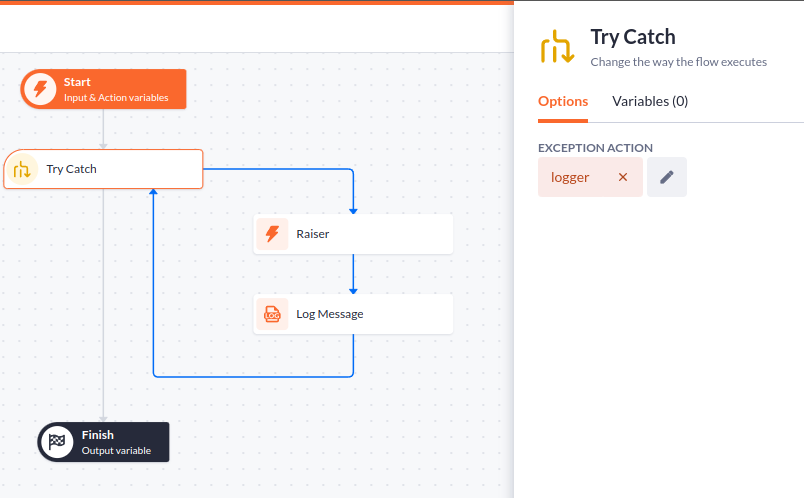

# try catch

A function for betty blocks actions that on the exception of the inner function runs the exception action instead

## example

Here the `Raiser` step will always raise an exception the next `Log message` step will never be executed, instead the `logger` action will be run instead.
